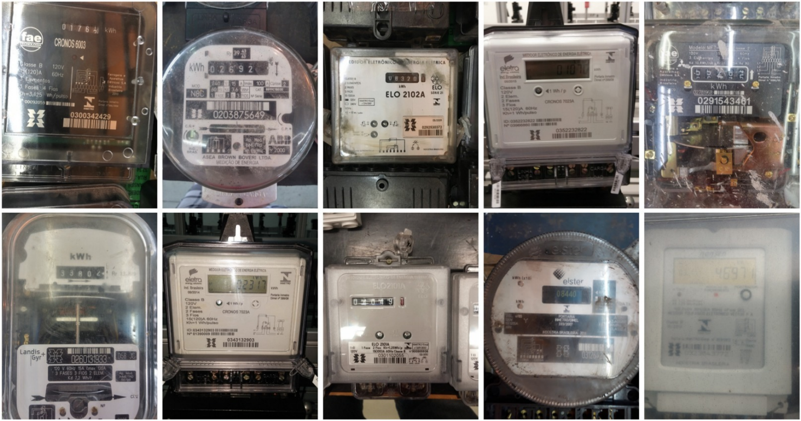

# UFPR-AMR Dataset ([Website](https://web.inf.ufpr.br/vri/databases/ufpr-amr/))

This dataset, called UFPR-AMR dataset, contains 2,000 images taken from inside a warehouse of the Energy Company of Paraná (Copel), which directly serves more than 4 million consuming units in the Brazilian state of Paraná. It has been introduced in our JEI paper [[PDF]](./pdfs/laroca2019convolutional.pdf).

The images were acquired with three different cameras and are available in the JPG format with a resolution between 2,340 × 4,160 and 3,120 × 4,160 pixels. The cameras used were: LG G3 D855, Samsung Galaxy J7 Prime and iPhone 6s.

The dataset is split into three sets: training (800 images), validation (400 images) and testing (800 images).

Every image has the following annotations available in a text file: the camera in which the image was taken, the counter’s position (x,y,w,h) and reading, as well as the position of each digit. All counters of the dataset (regardless of meter type) have 5 digits, and thus 10,000 digits were manually annotated. The full details are in our [paper](./pdfs/laroca2019convolutional.pdf).


Here are some examples from the dataset:  


## How to obtain the Dataset

The UFPR-AMR dataset is released for academic research only and is free to researchers from educational or research institutes for **non-commercial purposes**.

Please click [**here**](./license-agreement.md) for more info about obtaining the dataset.

You can now check who is downloading our dataset (see [**here**](https://www.inf.ufpr.br/rblsantos/misc/ufpr-amr-map/)).

## Citation

If you use the UFPR-AMR dataset in your research, please cite our paper:

* R. Laroca, V. Barroso, M. A. Diniz, G. R. Gonçalves, W. R. Schwartz, D. Menotti, “*Convolutional Neural Networks for Automatic Meter Reading*,” Journal of Electronic Imaging, vol. 28, no. 1, p. 013023, 2019. [[SPIE Digital Library]](https://doi.org/10.1117/1.JEI.28.1.013023) [[arXiv]](https://arxiv.org/abs/1902.09600)

```
@article{laroca2019convolutional,
  author = {R. {Laroca} and V. {Barroso} and M. A. {Diniz} and G. R. {Gon{\c{c}}alves} and W. R. {Schwartz} and D. {Menotti}},
  title = {Convolutional Neural Networks for Automatic Meter Reading},
  journal = {Journal of Electronic Imaging},
  volume = {28},
  number = {1},
  pages = {013023},
  year = {2019},
  ISSN = {1017-9909},
  doi = {10.1117/1.JEI.28.1.013023},
}
```

You may also be interested in our [**new research**](./pdfs/laroca2021towards.pdf), where we proposed an end-to-end approach for AMR in unconstrained scenarios and introduced the [Copel-AMR](https://github.com/raysonlaroca/copel-amr-dataset) dataset:

* R. Laroca, A. B. Araujo, L. A. Zanlorensi, E. C. de Almeida, D. Menotti, “*Towards Image-based Automatic Meter Reading in Unconstrained Scenarios: A Robust and Efficient Approach*,” IEEE Access, vol. 9, pp. 67569-67584, 2021. [[IEEE Xplore]](https://doi.org/10.1109/ACCESS.2021.3077415) [[arXiv]](https://arxiv.org/abs/2009.10181)

## Contact

Please contact Rayson Laroca ([rblsantos@inf.ufpr.br](mailto:rblsantos@inf.ufpr.br)) with questions or comments.